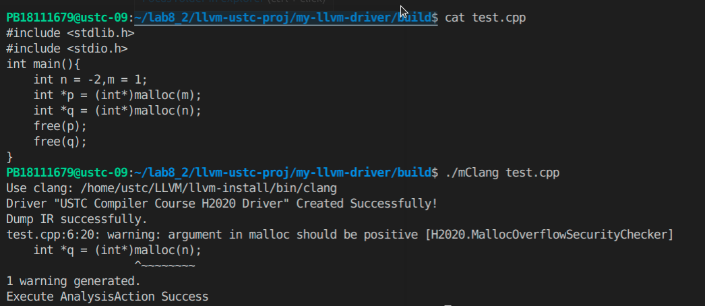
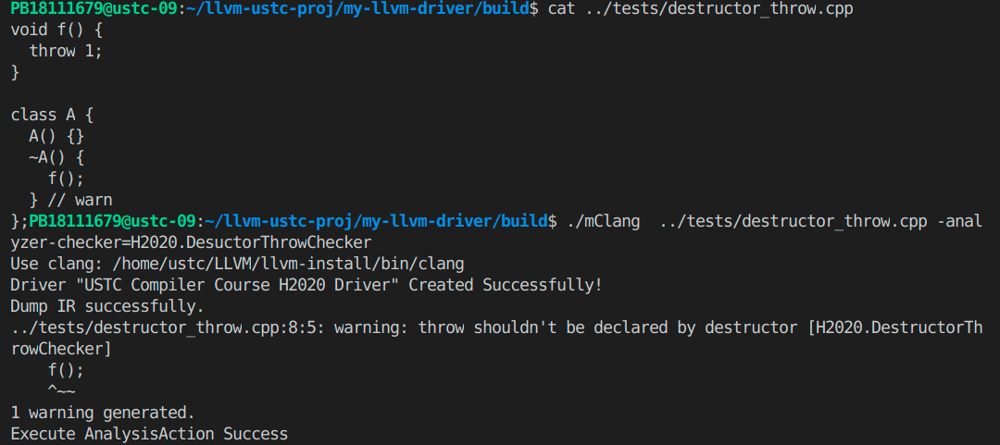
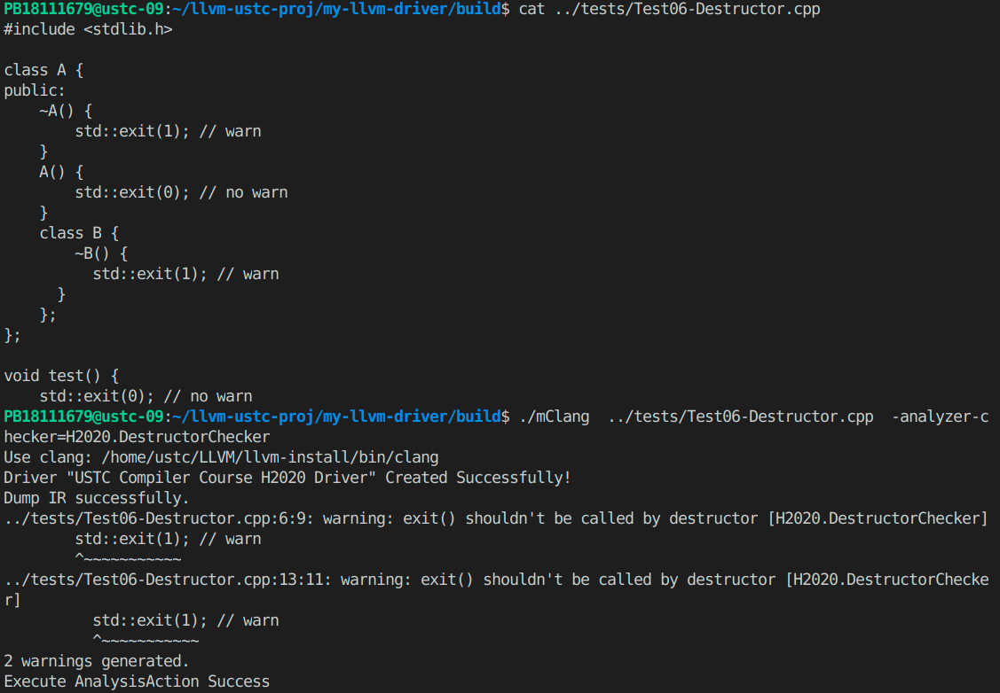
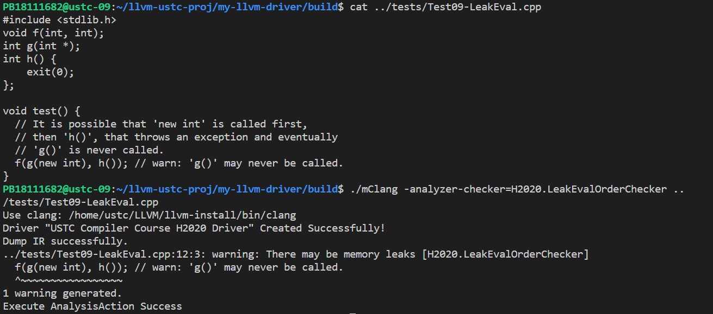

## 内存检查

### 动态分配参数检查

#### 1.检查目标
在这里，我们参考 `list of potential checker`，针对`malloc` 中参数为负数以及 `new` 中参数为负数的情况进行检查。实际上，`malloc`和`new`的参数为64位无符号整数，如果其实际参数为一个负数的话，那么这个负数会转化成一个很大的64位无符号整数（大于等于$ 2^{63}$），而一般情况下，操作系统是无法动态分配如此大的内存空间的，因此我们可以在实际参数为负数的情况下报出警告。


#### 2.实现思路
在 `Clang Static Analyzer` 遍历 `CFG` 检测的过程中，我们在每一个函数调用前，调用 `checkPreStmt` 进行分析。如果这个函数是`malloc`或`new`,就对函数的参数进行检查。通过 `ConstraintManager` 提供的 `assumeInclusiveRangeDual`方法对符号值进行约束，通过约束的结果，判断出原来的参数是否为负数，并在程序点处报出错误。

`malloc`中得到参数和判断参数是否为正对应的代码：

```c++
  if( CE->getDirectCallee()->getNameAsString() == "malloc" ) {
    // get Symbolic value of argument
    const Expr *arg1 = CE->getArg(0);
    SVal Argument = C.getSVal(arg1);
    Optional<NonLoc> NL = Argument.getAs<NonLoc>();
    // return as the argument is not a concrete int
    if(!NL || NL->getSubKind() != nonloc::ConcreteIntKind){
        return;
    }
    // get the bit width of argument
    const auto Value = NL->castAs<nonloc::ConcreteInt>().getValue();
    unsigned Width =  Value.getBitWidth();
    ConstraintManager &CM = C.getConstraintManager();
    // two kinds of programstate
    ProgramStateRef stateNonPositive, statePositive;
    // whether the argument is unsigned or not
    bool isUnsigned = Value.isUnsigned();
    // check whether the argument is positive
    std::tie(stateNonPositive, statePositive)
      = CM.assumeInclusiveRangeDual(C.getState(), 
          *NL,
          llvm::APSInt(llvm::APInt(Width, 1), isUnsigned),
          llvm::APSInt(llvm::APInt(Width, pow(2,Width-1) - 1),isUnsigned) );
```

`new`中得到参数对应的代码（判断正负与`malloc`相同）：

```c++
    unsigned implicitargs = Call.getNumImplicitArgs();
    const Expr * arg1=nullptr;
    if (const CallExpr *CE = dyn_cast<CallExpr>(Call.getOriginExpr())) {
        arg1 = CE->getArg(0);
    }
    else if (const CXXNewExpr *NE = dyn_cast<CXXNewExpr>(Call.getOriginExpr())) {
        if (NE->isArray()) {
            arg1 = *NE->getArraySize();
        } 
        else {
            return;
        }
    }
    else {
        llvm_unreachable("not a CallExpr or CXXNewExpr");
    }

    // get symbolic value of argument
    SVal Argument = C.getSVal(arg1);
```

#### 3.效果展示
如下图所示，在 `main` 函数中，第一次调用 `malloc` 时实际参数为1，没有提醒；第二次调用 `malloc` 时实际参数为`-2`,产生了一个提醒,要求 `malloc` 的参数为正数。


下图为`new`的测试，第一次调用参数为1，正确第二次调用参数变为-1，报`warning`，提醒`new`的参数应该是正数。


#### 4.无法分析的问题

如下图所示，在`main`函数中，`malloc` 函数的实际参数为不确定的输入值。在这里我选择不报错，因此这样可能会产生 `false negative` 的情况。


另外，当用户真的需要动态分配非常大的内存时，这个 `checker` 可能会把一个非常大的无符号整数当成一个负数。虽然这样的内存分配一般不会成功，但是其无法成功的原因是内存不足，而非 `malloc` 参数为负数。所以这里会产生一个 `false positive` 的错误。


### 指针越界检查

#### 1.检查目标
当调用 `strcpy(dst,src)` 的时候，可能由于目标指针`dst`所指向的内存空间大小小于复制字符串的长度，从而出现内存非法访问的问题。此时，我们修改了 `CStringChecker` 的代码来跟踪检查经过`malloc`得到的指针，通过比较这些指针指向内存空间的大小，从而判断strcpy是否会有问题。

#### 2.实现思路
在`CFG` 的`malloc`函数调用后，`CStringChecker`调用了`checkPostCall`函数，里面类似于`SimpleStreamChecker`，使用一个全局映射 `PointerMemMap` 记录 `malloc` 得到的指针所指向内存空间的大小。由于这里的map的

#### 3.效果展示


#### 4.无法分析的问题


### 析构函数检查


#### 1.检查目标
我们希望检查析构函数中是否有 `exit` 函数和 `throw` 语句。如果有这些语句，那么析构函数没办法正常结束，因此会导致变量的内存不能被正常释放从而造成了内存泄露。所以，我们写了 `DestructorChecker` 和`DestructorThrowChecker` 分别检查以上两种情况。

#### 2.设计思路
首先，我们需要知道当前程序状态点是否在析构函数中。在这里，我们使用全局的布尔变量 `inDestructor` 来标记。在CFG上进入一个函数的时候，检查器通过调用 `checkBeginFunction`，利用 `CheckerContext` 对象提供的上下文信息，来判断这个函数是否为析构函数。当这个函数为析构函数的时候，将 `inDestructor` 置位为 `true`。当在CFG上离开一个函数的时候，检查器调用 `checkEndFunction`，将 `inDestructor` 复位为 `false`。

在遍历 `CFG` 的析构函数的每一个函数表达式之前， `DestructorChecker` 调用 `checkPreStmt` 判断其是否为 `exit` 函数，如果是，则报出警告；`DestructorThrowChecker` 调用 `checkPreStmt`，通过遍历其函数体的 `AST` 来查找这个函数中是否有 `throw` 语句。`DestructorChecker` 判断 `exit` 函数的代码如下：
```cpp
void DestructorChecker::checkPreStmt(const CallExpr *CE,CheckerContext &C) const {
    if(inDestructor && CE->getDirectCallee()->getNameAsString() == "exit") {
        // report bug
        if (!BT) {
            BT.reset(new BugType(this,
            "exit() shouldn't be called by destructor","DestructorChecker"));
        }
        ExplodedNode *N = C.generateErrorNode();
        auto Report = std::make_unique<PathSensitiveBugReport>(*BT,
                        "exit() shouldn't be called by destructor",N);
        // report explicitly
        C.emitReport(std::move(Report));
    }
}
```
而DestructorThrowChecker判断是否有throw语句的代码如下：
```cpp

void DestructorThrowChecker::checkPreStmt(const CallExpr *CE, CheckerContext &C) const {
    if(inDestructor3) {
        const FunctionDecl* D = CE->getDirectCallee();
        if (!D) {
            return;
        }
        const Stmt* S = D->getDefinition()->getBody();
        for (const auto *Child : S->children()) {
            const CXXThrowExpr* TE = dyn_cast<CXXThrowExpr>(Child);
            if (!TE) {
                return;
            }
            if (!BT) {
                BT.reset(new BugType(this,
                "throw shouldn't be declared by destructor","DestructorStaChecker"));
            }
            ExplodedNode *N = C.generateErrorNode();
            auto Report = std::make_unique<PathSensitiveBugReport>(*BT,
                            "static variable shouldn't be declared by destructor",N);
            // report explicitly
            C.emitReport(std::move(Report));
        }
    }
}
```

#### 3.效果展示
使用`DestructorThrowChecker` 分析以下的程序会警告throw不能在析构函数中被使用，说明这里可以正常分析。

使用 `DestructorChecker`分析以下的程序，会对析构函数中的exit进行警告，对构造函数以及main函数则不会警告。



### 静态函数的分析


### 参数顺序造成的内存泄漏

#### 1.检查目标

在一个函数调用参数的时候，假如位置在先的参数是一个函数并且开辟了新的内存空间，而位置在后的参数没有返回的情况下，就可能会造成位置在先的函数没有被调用，内存泄漏。


#### 2.实现思路

检查每个函数的参数中是否含有开辟新的内存空间的函数和没有返回的函数共存的情况。

`getNoReturn()`检查是否有返回值：

```c++
bool LeakEvalOrderChecker::getNoReturn(const CallExpr *CE,CheckerContext &C) const {
    const FunctionDecl* D = CE->getDirectCallee();
    if (!D) {
        return false;
    }
    if (D->isNoReturn()) {
        return true;
    }
    if (!D->getDefinition()) {
        return false;
    }
    const Stmt* S = D->getDefinition()->getBody();
    for (const auto *Child : S->children()) {
        const CXXThrowExpr* TE = dyn_cast<CXXThrowExpr>(Child);
        if (TE) {
            return true;
        }
        const CallExpr* CC = dyn_cast<CallExpr>(Child);
        if (CC) {
            D = CC->getDirectCallee();
            if (D && D->isNoReturn()) {
                return true;
            }
        }
    }
    return false;
}
```

`getMallocOrNew()`检查是否有开辟内存空间：

```c++
bool LeakEvalOrderChecker::getMallocOrNew(const CallExpr *CE,CheckerContext &C) const {
    if(!CE->getNumArgs()) {
        return false;
    }
    if (CE->getDirectCallee()->getNameAsString() == "malloc") {
        return true;
    }
    const CXXNewExpr *NE = dyn_cast<CXXNewExpr>(CE->getArg(0));
    if (NE) {
        return true;
    }
    return false;
}
```

检查参数中是否同时含有这两种函数，如果是的话，报告warning：

```c++
    for (unsigned i = 0; i < num; i++) {
        const CallExpr* CallArg = dyn_cast<CallExpr>(CE->getArg(i));
        if (!CallArg) {
            continue;
        }
        const ReturnAndMalloc* RAM = State->get<MemLeakMap>(CallArg);
        if (RAM) {
            NoReturn |= RAM->getNoReturn();
            MallocOrNew |= RAM->getMallocOrNew();
        }
    }
    if (NoReturn && MallocOrNew) {
        ReportBug(C);
        return;
    }
```

#### 3.效果展示

